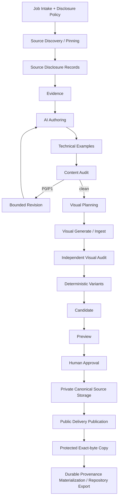

# Article Pipeline Architecture

## Design goal

**verified evidence -> disclosure-admitted semantic AI where external -> bounded verification/audit -> deterministic media processing -> human approval -> durable private source/public delivery/protected recovery -> cleanup-safe repository provenance** を1つのtraceable Article Jobとして扱う。

`video-evidence-pipeline`のstage/artifact/manifest/gate patternをsite domainへ縮小移植するが、private Article Job全体の永久保存は要求しない。

## Layers



External semantic/vision/image edges are not implicit arrows。Every external provider call passes an exact disclosure-manifest gate first。

## 0. Job intake / external disclosure policy

Validated `ArticleJobSpec` binds:

- operation/ContentId/topic/reader/constraints;
- provider-use permissions;
- `ExternalAiInputPolicyBinding`;
- explicit user disclosure authorizations for named inputs where applicable;
- media/persistence/export permissions。

Initial disclosure profile=`operations/external-ai-disclosure-profile.md` (`article-external-ai-disclosure-v1`)。

Key separation:

```text
provider use permission != exact input disclosure admission
```

- private/unknown input defaults deny;
- actual secret/capability material hard-deny;
- public source admission requires independently verified public acquisition class;
- user/private/local input requires explicit exact/derived authorization;
- semantic AI/Skill cannot create/expand disclosure authority。

## 1. Source discovery / pinning / disclosure records

Source discovery proposes candidate locators only。

Deterministic acquisition/pinning establishes:

- actual URL/repository/artifact identity;
- exact hash/revision/freshness metadata;
- source trust/publication metadata;
- **independent `ExternalAiDisclosureRecord`**。

A source may be valid evidence but disclosure-denied for external AI。

For external source discovery, the exact user-authorized ArticleJobBrief/seed artifacts are manifest-admitted before provider call。Provider search result is not canonical evidence until deterministic pinning。

## 2. External request admission gate

Before every external source-discovery/evidence/author/audit/revision/visual-plan/visual-audit/image-generation request:

1. compile exact final provider input artifacts, including generated prompt/context artifacts;
2. validate stage provider-use permission;
3. resolve current disclosure record for each artifact;
4. prove `allow_derived_only` uses the admitted derivative, never raw source;
5. reject deny/unknown/stale/hash-mismatched/hard-secret input;
6. run final serialized request secret/private exclusion validation;
7. require `ExternalAiDisclosureManifest.entries` exactly equals actual outbound artifact set;
8. bind manifest SHA into request/run lineage;
9. only then call provider。

Provider adapter cannot append hidden file/context after the manifest is fixed。

If required evidence is denied:

- use admitted safe local derivative;
- use configured local/non-external backend;
- request explicit authorization;
- narrow/remove claim;
- or `BLOCKED` + limitation。

Never silently omit required evidence and claim completeness。

## 3–8. Content/evidence path

3. atomic evidence/ambiguity construction from fixed source identities
4. AI authoring with fixed Skill/source/taxonomy/module snapshots and exact admitted request inputs
5. technical-example assessment through isolated profiles
6. fresh independent content audit
7. finite revision loop; P0/P1 remains -> BLOCKED
8. durable material-claim support proposal prepared before human approval

AI never writes canonical content tree directly。

Citation URL is not freely authored; fixed Source ID markers are deterministically compiled。

Technical example exact profiles=`../operations/technical-example-profiles.md`。

External evidence/author/auditor stages receive only request-admitted artifacts。A fixed SourceRecord does not itself imply provider disclosure permission。

## 9. Visual planning

After content is clean, build 0..N visual plans。

Blog hero required。Source media / AI conceptual / deterministic cover are allowed according to collection policy。

Planner does not authorize media rights, persistent storage, or private-input disclosure。

External visual planner receives only admitted article/evidence context。

## 10. Visual generation / ingest

Source/camera/screenshot:

- `media-ingest-contract.md`
- privacy-normalized lossless canonical master

AI visual:

- provider raw output is job-private immutable artifact
- generation request/provider/raw/disclosure-manifest lineage is recorded
- same canonical normalization path after import

Deterministic visual:

- Mermaid/SVG/design-system renderer etc。

Raw camera original is not automatically copied to long-term site storage and is not externally sent merely because image generation/vision is enabled。

## 11. Independent visual audit

Fresh-context visual/canonical audit:

- relevance
- fake UI/terminal/graph/metric
- text/logo artifact
- crop/composition
- rights/provenance/safety

External visual audit target image/article context must each be disclosure-admitted。Local visual audit can process denied-private inputs without creating external disclosure authority。

Rejected visual gets no delivery variant generation。

## 12. Deterministic media variants

After clean visual audit:

- privacy-normalized canonical source
- deterministic AVIF/WebP/fallback variants
- no upscale
- profile/toolchain hashes
- no network/Cloudflare Images/public upload

Fixed SVG/social/download may use `not_required` variant manifest。

Profile/master bytes change => candidate downstream stale。

## 13. Candidate materialization

Private candidate contains/binds:

- MDX/frontmatter
- detailed source/evidence/claim artifacts
- cleanup-safe material-claim support ledger proposal
- citation/example verification
- content/visual audits
- canonical media source/profile
- delivery variant manifests
- Media Registry/rights proposals
- private source/public/protection persistence plans
- pre-persistence Publication Provenance proposal
- candidate manifest

External disclosure records/manifests are operational private lineage, not reader article bytes。Their safe policy/manifest hash lineage may later be compacted into provenance without altering candidate content/media/support semantics。

No persistent media/provider mutation。

## 14. Preview

Local candidate media adapter + Astro preview validates:

- schemas/ContentId/taxonomy/routes
- citations/examples/material claim lineage proposal
- SEO/structured data
- responsive media/hero/social
- accessibility/hydration/performance

## 15. Human approval

Review bundle binds exact candidate hash and includes:

- content/diff
- material claims/evidence/citations/examples
- limitations including disclosure-denied evidence that affects completeness
- audits
- canonical/delivery media summary
- planned private/public media
- rights/provenance

AI/Skill cannot create HumanApprovalRecord or disclosure authorization。

## 16. Private canonical source storage

After approval, before public delivery:

```text
approved canonical source
 -> private source-media storage/reuse
 -> SHA/size verification
 -> CanonicalSourceStorageReceipt
 -> MEDIA_SOURCE_STORED
```

Raw HEIC/JPEG/PNG/provider original is not stored as canonical source。Failure remains `HUMAN_APPROVED`/BLOCKED and prevents public publication。

## 17. Public delivery publication

Legal from `MEDIA_SOURCE_STORED` only when public media is required。

- exact approved delivery set
- content-addressed immutable keys
- complete required variants
- immutable Cache-Control metadata
- rights/permission/lifecycle revalidation
- MediaPublicationManifest

Failure remains `MEDIA_SOURCE_STORED`; success -> `MEDIA_PUBLISHED`。

Cloudflare Images output is not canonical publication identity。

## 18. Published media protection

From `MEDIA_PUBLISHED`:

- exact public required object set
- protected private recovery plane
- SHA/size equality
- accepted protection policy
- full MediaProtectionReceipt with secret-free opaque protected refs

Failure remains `MEDIA_PUBLISHED` and blocks export。Success -> `MEDIA_PROTECTED`。

## 19. Durable provenance materialization / export

Prerequisite:

- exact candidate/approval
- current detailed source/evidence/claim artifacts
- valid external request/run disclosure lineage for every external AI run
- CanonicalSourceStorageReceipt set / not_required
- MediaPublicationManifest / empty result
- MediaProtectionReceipt / empty result
- repository base revalidation

Before `EXPORTED`, deterministic executor derives:

1. `CompactSourceRef[]`;
2. `CompactMaterialClaimBinding[]` preserving published material claim -> evidence interpretation -> source identity;
3. compact canonical-media source identities/profile lineage;
4. compact AI/tool run lineage;
5. for every external AI run, safe disclosure policy ID/hash + exact request disclosure-manifest hash + non-sensitive mode summary;
6. `CompactMediaRecoveryBinding` from full valid MediaProtectionReceipt when media exists;
7. exact equality between publication/protection/recovery object sets;
8. no private source body/path, full private disclosure inventory, credential, signed URL, prompt/private reasoning in durable Git provenance。

Export:

- MDX/frontmatter
- Media Registry
- Publication Provenance (`sourceRefs`, `materialClaims`, safe AI/disclosure lineage, `mediaRecovery`)
- separately approved taxonomy/interactive changes

Bundle/receipt/manifest hash alone is insufficient when required semantic/recovery information would disappear at cleanup。

Post-approval operational fields may be appended only if approved content/media/support stays identical。Material change => new candidate/approval。

Media bytes/private job artifacts are not exported。PR/merge/deploy are separate side effects。

## 20. Workspace cleanup

Exact policy=`../operations/article-job-retention-policy.md` / ADR-0024。

Cleanup requires at least:

- `EXPORTED`
- exact durable Git ref with expected content/provenance
- durable material claim bindings valid
- external AI runs have required safe policy/manifest/run hash lineage
- source/public/protection persistence chain valid
- compact media recovery binding valid when media exists
- no unresolved orphan/disclosure-security incident tracking
- explicit operator confirmation

Only then may raw inputs, detailed source/evidence, private disclosure records/manifests/derived artifacts, AI request/response payloads, full receipts, local media variants, and previews be deleted when not under explicit incident hold。

Cleanup never deletes Git/R2 objects and never copies private disclosure/source bodies into Git as a workaround。

## Create/update

New content gets new ContentId。Existing update keeps same ContentId + prior-state/diff。

Same semantic media asset ID may survive a media replacement, while new bytes always get new content-addressed physical objects。

## Implementation boundary

```text
apps/site/
packages/content-contracts/
packages/article-pipeline/
packages/media-ingest/
packages/example-verifier/
packages/site-validators/
```

- content-contracts: schemas incl disclosure records/manifests/provenance
- article-pipeline: source pinning, disclosure-policy application, exact request-manifest compilation, semantic provider adapters, state/persistence orchestration
- media-ingest: HEIC/privacy normalization/variants
- example-verifier: isolated example execution
- site-validators: deterministic repository/export/profile checks

Exact initial external disclosure defaults=`operations/external-ai-disclosure-profile.md`。
