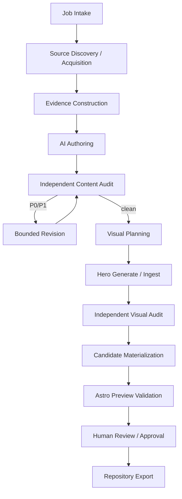

# Article Pipeline Architecture

## Design goal

中核は「LLM に MDX を1回書かせること」ではない。

**検証可能な source / evidence bundle から article candidate と visual candidate を構築し、独立監査と human approval を経て repository content へ export すること**を目的とする。

`video-evidence-pipeline` の stage / artifact / manifest / gate pattern を縮小移植する。ただし video transcription 等の不要な domain は持ち込まない。

field semanticsは`docs/contracts/`を正とする。

## Layers



## 1. Job intake

入力:

- topic / working title
- target collection
- reader outcome / assumed knowledge
- article mode
- user notes / repository refs / local assets
- public / private boundary
- network / external AI permission
- image-generation permission
- optional target taxonomy / legacy URL hints

出力は validated `ArticleJobSpec` と job fingerprint。

exact contractは`contracts/article-job-contract.md`。

permission のない external operation を semantic agent が勝手に開始しない。

## 2. Source discovery and acquisition

source discoverer は候補 source を提案できるが、canonical evidence identity を自分で確定しない。

deterministic executor が source reference を固定する。

source type 例:

- official docs / release notes / standards
- public web page
- GitHub repository file / commit / release
- user-provided notes / logs
- normalized local image / screenshot
- existing repository canonical docs

GitHub source は可能な限り commit SHA へ pin する。web source は canonical URL、retrieved time、publisher、必要なら private snapshot hash を持つ。

web page 全体を public repository へ複製しない。

exact source identityは`contracts/source-evidence-claim-contract.md`。

## 3. Evidence construction

Evidence analyst は fixed source bundle から atomic claim candidate と ambiguity を生成する。

1 evidence record = 1 proposition を基本とし、離れた source を結合して source が支持しない因果関係を作らない。

claim class:

- source fact
- user observation / experience
- inference
- recommendation
- unknown / limitation

external fact を source ref なしに確定しない。

## 4. AI authoring

article author には次だけを固定入力として渡す。

- job requirements
- selected evidence bundle
- unresolved ambiguity
- editorial Skill snapshot
- taxonomy registry snapshot
- content-module registry snapshot

出力:

- `draft.mdx`
- `claims.jsonl`
- `metadata-proposal.json`
- `taxonomy-proposal.json`
- `visual-needs.json`
- author run record

AI は repository の canonical `src/content/` へ直接書かない。

Blog metadataのtarget shapeは`contracts/blog-frontmatter-contract.md`、taxonomyは`contracts/taxonomy-registry-contract.md`、MDX moduleは`contracts/content-module-contract.md`を正とする。

## 5. Independent content audit

auditor は fresh context で target draft と fixed evidence を読む。

物理 audit request に author prompt history、private reasoning、author claim ledger を「正解」として含めない。auditor は本文から material claim を再抽出する。

severity:

- P0: fabricated fact / source、逆内容、publication safety breach、重大な false representation
- P1: material evidence gap、unsupported inference、version/date error、重要要件欠落、misleading technical instruction
- P2: clarity、redundancy、minor structure / style

P0/P1 が残る candidate は visual generation へ進めない。

## 6. Bounded revision

revision は current findings と evidence に限定する。

全面的な新規主張追加を revision shortcut として許可しない。

自動 semantic revision は有限回とし、上限後も P0/P1 が残る場合は `BLOCKED`。

exact revision count は machine-readable policy で持つ。

## 7. Visual planning

text content が audit-clean になった後、visual planner が hero strategy と article visual needs を決める。

出力 `visual-plan.json`:

- strategy: `source_media | ai_generated | deterministic_cover`
- semantic concept
- relation to article
- forbidden factual depiction
- composition / safe-area intent
- preferred style profile
- source media refs if any
- alt / disclosure proposal
- whether inline factual visual is separately required

exact contractは`contracts/visual-artifact-contract.md`。

visual planner は画像 bytes を生成しない。

## 8. Hero generation / ingest

### source_media

既存 `media-pipeline.md` に従い normalized web master を作る。

### ai_generated

deterministic executor が visual plan + site style profile + hard restrictions から generation request を構築し、`ImageGenerationBackend` を呼ぶ。

生成は non-deterministic なので、prompt / model snapshot だけから再現可能と主張しない。生成された raw bytes 自体を immutable artifact として hash する。

### deterministic_cover

site design tokens と article metadata から SVG / raster cover を deterministic に生成する。

## 9. Independent visual audit

fresh-context vision auditor は article、visual plan、candidate image を検査する。

- topic relevance
- misleading factual appearance
- accidental / garbled text
- fake UI / fake terminal / fake graph
- unintended logo / trademark implication
- composition / crop safety
- visual quality
- policy / publication safety

visual audit は image generator の自己評価だけに依存しない。

## 10. Candidate materialization

deterministic executor が approved semantic outputs から private candidate tree を生成する。

- MDX
- frontmatter
- normalized hero
- social-card derivative
- local content assets
- compact publication provenance
- candidate manifest

candidate / approval bindingは`contracts/candidate-approval-contract.md`。

この段階でも working tree の canonical content を直接変更しなくてよい。

## 11. Preview validation

candidate を temporary materialization して Astro build / preview を行う。

- schema / taxonomy
- route conflict
- SEO metadata
- responsive images
- hero / OG
- accessibility checks
- client JS / performance budget
- representative screenshot

preview は target candidate hash と repository base commit / build fingerprint に bind する。

## 12. Human review and approval

human review package は少なくとも次を含む。

- rendered preview
- title / description / taxonomy
- source / evidence summary
- unresolved limitation
- content audit result
- hero origin / visual provenance summary
- visual audit result
- diff against prior article version if updating
- exact candidate hash

AI / Skill は approval record を作れない。

## 13. Repository export

human-approved exact candidate からのみ export する。

export target:

- feature branch working tree / patch
- `src/content/...`
- normalized assets
- machine-owned compact provenance record where configured

PR creation は便利機能として追加できるが GitHub external mutation なので explicit operation とする。merge / deploy は Article Job の権限ではない。

## Convenience runner

低レベル contract は `prepare -> semantic run -> import` を正とする。

その上に人間向け convenience command を持てる。

```text
site article run <job>
```

runner は semantic provider に canonical write permission を与えず、各 stage を同じ import validator 経由で実行する。

## Implementation boundary

Article Job orchestration は Astro page runtime と分離する。

初期実装候補:

```text
tools/article-pipeline/
  domain/
  schemas/
  providers/
  stages/
  storage/
  cli/
```

TypeScript + Zod を第一候補とし、JSON Schema は domain schema から生成する。article orchestration のためだけに別 Python runtime を必須化しない。HEIC decode 等の専用 native toolchain は media adapter / container boundary へ分離する。
