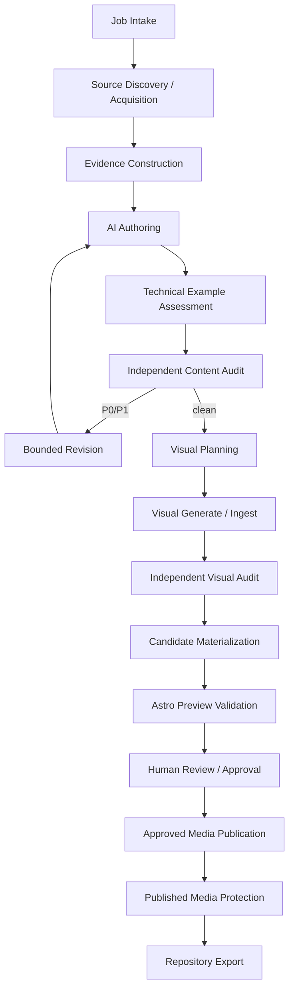

# Article Pipeline Architecture

## Design goal

中核は「LLMにMDXを1回書かせること」ではない。

**検証可能なsource / evidence bundleからarticle candidateとvisual candidateを構築し、technical example検証、独立監査、preview、人間承認、approved media publication、recovery protectionを経てrepository contentへexportすること**を目的とする。

`video-evidence-pipeline`のstage / artifact / manifest / gate patternを縮小移植する。ただしvideo transcription等の不要domainは持ち込まない。

field semanticsは`docs/contracts/`を正とする。

## Layers



## 1. Job intake

入力:

- create / update operation
- topic / working title
- target collection / ContentId
- reader outcome / assumed knowledge
- article mode / update kind
- user notes / repository refs / local assets
- public / private boundary
- network / external AI permission
- image-generation permission
- public media upload permission policy
- optional taxonomy / legacy URL hints

出力はvalidated `ArticleJobSpec`とjob fingerprint。

exact contractは`contracts/article-job-contract.md`。

permissionのないexternal operationをsemantic agentが開始しない。

## 2. Source discovery and acquisition

`discover-article-sources` Skill等のsource discovererはcandidate sourceを提案できるが、canonical evidence identityを確定しない。

deterministic executorがsource referenceをpinする。

source type:

- official docs / release notes / standards
- public web page
- GitHub repository file / commit / release
- user-provided notes / logs
- local image / screenshot
- existing repository canonical docs

GitHub sourceは可能な限りcommit SHAへpin。web sourceはcanonical URL、retrieved time、publisher、必要ならprivate snapshot hashを持つ。

web page全体をpublic repositoryへ複製しない。

## 3. Evidence construction

Evidence analystはfixed source bundleからatomic evidence candidateとambiguityを生成する。

1 evidence record = 1 propositionを基本とし、sourceが支持しない新しい因果関係を合成しない。

class:

- source fact
- user observation / experience
- inference
- recommendation
- unknown / limitation

external factをsource refなしにconfirmedへ昇格しない。

## 4. AI authoring

article authorには次をfixed inputとして渡す。

- job requirements
- selected evidence bundle
- unresolved ambiguity
- editorial Skill snapshot
- taxonomy registry snapshot
- content-module registry snapshot
- interactive-module registry snapshot

出力:

- `draft.mdx`
- `claims.jsonl`
- `metadata-proposal.json`
- `taxonomy-proposal.json`
- `visual-needs.json`
- author run record

### Citation marker

AIはcitation URL/titleを自由生成せず、fixed Source IDだけをlogical citation markerとして参照する。

candidate materializationでdeterministic executorがvalidated source metadataからstandard Markdown footnoteへ変換する。

AIは`apps/site/src/content/`へ直接writeしない。

## 5. Technical example assessment

DRAFTED後、deterministic extractorがcode / command / configuration / output blockを抽出する。

software articleでは可能な範囲で:

- syntax / schema check
- isolated sandbox execution
- evidence-observed result binding

を行う。

arbitrary AI-generated codeをhostで直接実行しない。network/system/external mutationはdefault deny。

execution boundaryは`packages/example-verifier`。

## 6. Independent content audit

auditorはfresh contextでtarget draft / fixed evidence / citation binding / technical example resultsを読む。

author private reasoningやself-evaluationを正解として渡さない。

P0/P1が残るcandidateはvisual stageへ進めない。

## 7. Bounded revision

revisionはvalidated findingとevidenceに限定する。

new material claimはevidence binding + re-audit、code/command変更はexample assessment再実行。

automatic semantic revisionはfinite budget。

## 8. Visual planning

content audit clean後、collection policyに応じて0..N visual planを生成する。

Blogではhero plan required。

strategy:

- `source_media`
- `ai_generated`
- `deterministic_cover`
- optional collectionではempty plan set

plannerはimage bytesを生成しない。

## 9. Visual generation / ingest

source mediaは`media-ingest`でprivate normalized candidate masterへ変換する。

AI visualはcompiled requestからprovider adapterを呼び、raw bytesをimmutable private artifactとしてhashする。

factual diagramはMermaid/SVG等のdeterministic sourceを優先できる。

rights basisをVisual Planner自身が承認しない。

## 10. Independent visual audit

candidate visualがある場合fresh vision contextでrelevance / fake factual depiction / accidental text/logo / crop / quality / publication safetyを検査する。

visual 0件のvalid collectionはempty audit manifest可。

## 11. Candidate materialization

deterministic executorがprivate candidate treeを生成する。

- MDX
- resolved frontmatter
- citation compilation
- technical example verification binding
- local normalized media masters
- deterministic social card candidate where required
- Media Registry proposal
- media rights records
- planned content-addressed R2 keys
- compact Publication Provenance proposal
- candidate manifest

public R2 upload / protected copyは行わない。

## 12. Preview validation

candidateをtemporary materializationしてAstro build / previewする。

preview media adapterはlocal candidate bytesを使い、public R2 mutationを要求しない。

checks:

- ContentId / schema / taxonomy
- route conflict
- citation/footnote output
- SEO metadata
- logical media resolution
- responsive image HTML
- hero/OG where required
- accessibility
- client JS / performance budget
- representative screenshot

previewはcandidate hash + repository base + build fingerprintへbindする。

## 13. Human review and approval

human review package:

- rendered preview
- create/update diff
- title / description / taxonomy
- source/evidence summary
- citation/example verification summary
- unresolved limitation
- content/visual audit
- planned public media + rights/provenance summary
- exact candidate hash

AI / Skillはapproval recordを作れない。

## 14. Approved media publication

human-approved exact candidateのlocal normalized mediaだけをpublic R2へpublishする。

```text
candidate media hash
  -> rights revalidation
  -> content-addressed public object key
  -> upload or verified reuse
  -> post-upload verification
  -> MediaPublicationManifest
```

rules:

- approval前upload禁止
- same keyへのdifferent bytes overwrite禁止
- partial failureはidempotent retry
- media 0件はempty manifest可

## 15. Published media protection

public mediaを唯一のrecovery copyにしない。

MediaPublicationManifestのexact object setを`published-media-protection-contract.md`に従ってprotected recovery copyへbindする。

```text
MediaPublicationManifest
  -> protection request
  -> protected copy/reuse
  -> identity/policy verification
  -> MediaProtectionReceipt
```

protection失敗:

- Git export禁止
- stateは`MEDIA_PUBLISHED`
- same immutable objectsでidempotent retry

## 16. Repository export

prerequisite:

- exact candidate human-approved
- valid MediaPublicationManifest
- valid MediaProtectionReceipt / valid empty protection result
- base repository state revalidated

export:

- `apps/site/src/content/...`
- `apps/site/src/content-registry/media/...`
- `apps/site/src/content-registry/provenance/...`
- taxonomy / interactive registry update if separately approved

media binaryはGitへexportしない。

PR creationは別external mutation。merge / deployはArticle Job権限外。

## Create versus update

new contentはnew stable ContentIdを割り当てる。

existing updateはsame ContentIdを維持し、prior-state bundle + diffをhuman reviewへ渡す。

## Convenience runner

低レベルcontractは`prepare -> semantic run -> import`を正とする。

`site article run <job>`は各stageをsame validator/state machine経由で実行するだけで、semantic providerへcanonical write permissionを与えない。

## Implementation boundary

```text
apps/site/
packages/content-contracts/
packages/article-pipeline/
packages/media-ingest/
packages/example-verifier/
packages/site-validators/
```

TypeScript + Zodをcontract SoT候補とし、AI exchange JSON Schemaを生成する。

HEIC decodeはmedia-ingest、technical code executionはexample-verifier、provider credentialsはarticle-pipeline adapter境界へ閉じ込める。
