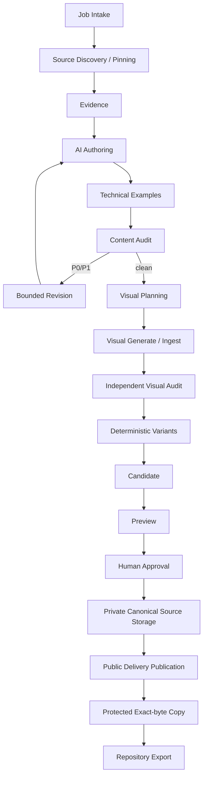

# Article Pipeline Architecture

## Design goal

**verified evidence -> AI authoring -> bounded verification/audit -> deterministic media processing -> human approval -> durable private source/public delivery/protected recovery -> repository export** を1つのtraceable Article Jobとして扱う。

`video-evidence-pipeline`のstage/artifact/manifest/gate patternを縮小移植する。

## Layers



## 1–7. Content/evidence path

1. validated `ArticleJobSpec`
2. semantic source discovery proposal + deterministic source pinning
3. atomic evidence/ambiguity construction
4. AI authoring with fixed Skill/source/taxonomy/module snapshots
5. technical example assessment through isolated profiles
6. fresh independent content audit
7. finite revision loop; P0/P1残存でBLOCKED

AIはcanonical content treeへ直接writeしない。

citation URLを自由生成せずfixed Source ID markerを使う。

technical example exact profilesは`../operations/technical-example-profiles.md`。

## 8. Visual planning

content clean後に0..N visual plan。

Blog hero required。source media / AI conceptual / deterministic coverから選ぶ。

plannerはrights承認/image bytes生成をしない。

## 9. Visual generation / ingest

source/camera/screenshot:

- `media-ingest-contract.md`
- privacy-normalized lossless canonical master

AI visual:

- provider raw outputをjob-private immutable artifact
- generation lineage hash
- same canonical normalization path

deterministic visual:

- Mermaid/SVG/design-system renderer等

raw camera originalをlong-term site storageへ自動送信しない。

## 10. Independent visual audit

semantic visual/canonical masterをfresh contextでauditする。

- relevance
- fake UI/terminal/graph/metric
- text/logo artifact
- crop/composition
- publication safety

reject visualへresponsive variant生成costを使わない。

## 11. Deterministic media variant generation

visual audit clean後、`media-processing-profiles.md` + `media-variant-generation-contract.md`へ従う。

- private canonical raster = lossless WebP/sanitized vector source
- public delivery master + AVIF/WebP/fallback variants
- no upscale
- profile/toolchain hash
- no network/Cloudflare Images/public upload

fixed SVG/social/downloadは`not_required` variant manifest可。

profile/master bytes変更でcandidate downstream stale。

## 12. Candidate materialization

private candidate tree:

- MDX/frontmatter
- citation compilation
- example verification
- content/visual audits
- canonical media source hash/profile
- delivery variant manifests
- Media Registry proposal
- rights records
- private canonical source storage plan
- public object key plan
- Publication Provenance proposal
- candidate manifest

persistent R2 mutationなし。

## 13. Preview

local canonical/variant adapterでAstro candidate preview。

checks:

- schema/ContentId/taxonomy/routes
- citations/examples
- SEO/structured data
- responsive media/hero/social
- accessibility/hydration/performance

## 14. Human approval

review packageはexact candidate hashへbind。

- content/diff
- evidence/citations/examples
- audits/limitations
- canonical source profile/hash
- delivery profile/variant summary
- planned private/public media
- rights/provenance

AI/Skillはapproval recordを作れない。

## 15. Private canonical source storage

approval後、public deliveryより先に`private-canonical-media-storage-contract.md`を実行する。

```text
approved privacy-normalized canonical source
 -> private source-media R2 content-addressed object
 -> exact SHA/size verification
 -> CanonicalSourceStorageReceipt
```

purpose:

- future format/quality/width re-generation
- lossy public artifactからの再encode回避

rules:

- raw HEIC/JPEG/PNG originalをそのままstoreしない
- no public domain
- no normal Delete/config-admin
- failure blocks public publication/export
- idempotent reuse

## 16. Public delivery publication

valid source-storage chain後、approved delivery master/required baseline variantsをpublic R2へpublish。

- content-addressed
- same key/different bytes禁止
- required set completeness
- immutable Cache-Control metadata
- rights revalidation
- MediaPublicationManifest

Cloudflare Images outputはcanonical publication artifactにしない。

## 17. Published media protection

exact public delivery object setをseparate private protected-media bucketへcopy/reuseしMediaProtectionReceiptを作る。

initial infra target:

- no public domain
- indefinite Bucket Lock
- no automatic expiration
- protection writer no Delete/config/lock change

failure blocks Git export。

## 18. Repository export

prerequisite:

- exact candidate/approval
- CanonicalSourceStorageReceipt set
- MediaPublicationManifest
- MediaProtectionReceipt
- base repository revalidation

export:

- content MDX/frontmatter
- Media Registry incl canonical source hash/profile + public delivery identities
- compact Publication Provenance incl storage/publication/protection receipt hashes
- separately approved taxonomy/interactive changes

media bytesはGitへexportしない。

PR/merge/deployは別side effect。

## 19. Workspace cleanup

full Article Job workspaceはlong-term recovery SoTではない。

`operations/article-job-retention-policy.md`に従い、export bytesがoperator-selected durable Git refへ取り込まれ、source/public/protected receipt chainがvalidな場合だけexplicit cleanup可能。

time-only automatic deletionやblind cleanupをしない。

## Create/update

new content=new ContentId。

existing update=same ContentId + prior-state/diff。

media updateもsame semantic asset IDを維持可能だがnew bytesはnew content-addressed objects。

## Implementation boundary

```text
apps/site/
packages/content-contracts/
packages/article-pipeline/
packages/media-ingest/
packages/example-verifier/
packages/site-validators/
```

TypeScript/Zodをmachine contract SoT候補。

HEIC/media encodingはmedia-ingest、code executionはexample-verifier、AI/provider/external storage adaptersはarticle-pipeline/infra permission boundaryへ閉じ込める。
