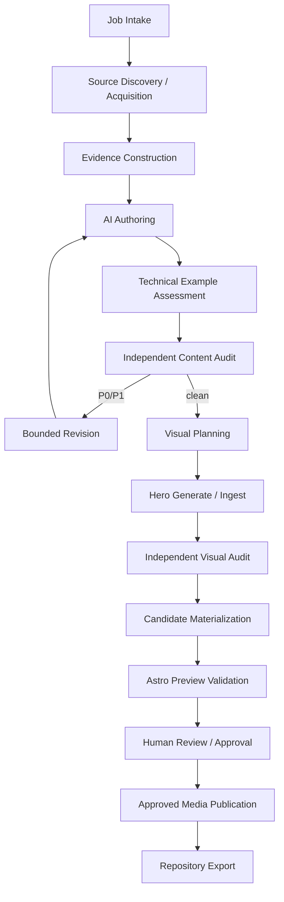

# Article Pipeline Architecture

## Design goal

中核は「LLMにMDXを1回書かせること」ではない。

**検証可能なsource / evidence bundleからarticle candidateとvisual candidateを構築し、technical example検証、独立監査、preview、人間承認、approved media publicationを経てrepository contentへexportすること**を目的とする。

`video-evidence-pipeline`のstage / artifact / manifest / gate patternを縮小移植する。ただしvideo transcription等の不要domainは持ち込まない。

field semanticsは`docs/contracts/`を正とする。

## Layers



## 1. Job intake

入力:

- create / update operation
- topic / working title
- target collection / ContentId
- reader outcome / assumed knowledge
- article mode / update kind
- user notes / repository refs / local assets
- public / private boundary
- network / external AI permission
- image-generation permission
- public media upload permission policy
- optional taxonomy / legacy URL hints

出力はvalidated `ArticleJobSpec`とjob fingerprint。

exact contractは`contracts/article-job-contract.md`。

permissionのないexternal operationをsemantic agentが開始しない。

## 2. Source discovery and acquisition

source discovererはcandidate sourceを提案できるが、canonical evidence identityを自分で確定しない。

deterministic executorがsource referenceを固定する。

source type:

- official docs / release notes / standards
- public web page
- GitHub repository file / commit / release
- user-provided notes / logs
- local image / screenshot
- existing repository canonical docs

GitHub sourceは可能な限りcommit SHAへpinする。web sourceはcanonical URL、retrieved time、publisher、必要ならprivate snapshot hashを持つ。

web page全体をpublic repositoryへ複製しない。

## 3. Evidence construction

Evidence analystはfixed source bundleからatomic evidence candidateとambiguityを生成する。

1 evidence record = 1 propositionを基本とし、sourceが支持しない新しい因果関係を合成しない。

class:

- source fact
- user observation / experience
- inference
- recommendation
- unknown / limitation

external factをsource refなしにconfirmedへ昇格しない。

## 4. AI authoring

article authorには次をfixed inputとして渡す。

- job requirements
- selected evidence bundle
- unresolved ambiguity
- editorial Skill snapshot
- taxonomy registry snapshot
- content-module registry snapshot
- interactive-module registry snapshot

出力:

- `draft.mdx`
- `claims.jsonl`
- `metadata-proposal.json`
- `taxonomy-proposal.json`
- `visual-needs.json`
- author run record

### Citation marker

AIはcitation URL / titleを自由生成しない。

fixed Source IDだけをlogical citation markerとして参照する。

candidate materializationでdeterministic exporterがvalidated Source metadataからstandard Markdown footnoteへ変換する。

exact contractは`contracts/citation-export-contract.md`。

AIは`apps/site/src/content/`へ直接writeしない。

## 5. Technical example assessment

DRAFTED後、deterministic extractorがcode / command / configuration / output blockを抽出する。

software articleでは可能な範囲で:

- syntax / schema check
- isolated sandbox execution
- evidence-observed result binding

を行う。

arbitrary AI-generated codeをhostで直接実行しない。network/system/external mutationはdefault deny。

exampleが0件でもempty verification manifestを生成する。

結果class:

- illustrative
- syntax_checked
- sandbox_executed
- evidence_observed
- not_verifiable

exact contractは`contracts/technical-example-verification-contract.md`。

## 6. Independent content audit

auditorはfresh contextで:

- target draft
- fixed evidence
- citation bindings
- technical example verification results

を読む。

author prompt history、private reasoning、author claim ledgerを正解として渡さない。本文からmaterial claimを再抽出する。

severity:

- P0: fabricated fact/source、逆内容、publication safety breach、重大なfalse representation
- P1: material evidence gap、unsupported inference、version/date error、重要要件欠落、failed critical tutorial example、misleading instruction
- P2: clarity、redundancy、minor structure/style

P0/P1が残るcandidateはvisual stageへ進めない。

## 7. Bounded revision

revisionはvalidated findingとevidenceに限定する。

new material claimはevidence bindingと再auditを要求する。

code / command block変更はexample verificationをstaleにし、再assessmentする。

automatic semantic revisionは有限回。上限後もP0/P1が残る場合は`BLOCKED`。

## 8. Visual planning

content audit clean後にhero strategyとarticle visual needを決める。

`visual-plan.json`:

- `source_media | ai_generated | deterministic_cover`
- semantic concept
- article relation
- forbidden factual depiction
- safe-area intent
- style profile
- source media refs
- alt / disclosure proposal
- factual inline visual need

plannerはimage bytesを生成しない。

## 9. Hero generation / ingest

### source media

`media-ingest-contract.md`に従いprivate normalized candidate masterを生成する。

### AI-generated

deterministic executorがvisual plan + style profile + hard restrictionsからgeneration requestをcompileし、`ImageGenerationBackend`を呼ぶ。

raw provider outputはimmutable private artifactとしてhashを固定する。

### deterministic cover / diagram

site design tokens + article metadataからdeterministicに生成する。

factual software diagramはAI illustrationよりdeterministic source (Mermaid/SVG等)を優先できる。

## 10. Independent visual audit

fresh-context vision auditorが:

- relevance
- fake UI / terminal / graph / metric
- garbled text
- unintended logo implication
- crop / composition
- visual quality
- publication safety

を検査する。

image generatorの自己評価だけに依存しない。

## 11. Candidate materialization

deterministic executorがprivate candidate treeを生成する。

- MDX
- resolved frontmatter
- logical citation -> Markdown footnote compilation
- local normalized media masters
- deterministic social card candidate
- semantic Media Registry proposal
- planned content-addressed R2 keys
- compact Publication Provenance proposal
- candidate manifest

public R2 uploadは行わない。

candidate / approval bindingは`candidate-approval-contract.md`、object identityは`public-media-publication-contract.md`を正とする。

## 12. Preview validation

candidateをtemporary materializationしてAstro build / previewする。

preview media adapterはlocal candidate bytesを使う。

checks:

- content ID / schema / taxonomy
- route conflict
- citation / footnotes
- SEO metadata
- logical media resolution
- responsive image HTML
- hero / OG
- accessibility
- client JS / performance budget
- representative screenshot

previewはcandidate hash + repository base commit + build fingerprintへbindする。

## 13. Human review and approval

human review package:

- rendered preview
- create/update diff
- title / description / taxonomy
- source / evidence summary
- technical example verification summary
- unresolved limitation
- content audit
- hero origin / visual provenance
- visual audit
- planned public R2 media objects
- exact candidate hash

AI / Skillはapproval recordを作れない。

## 14. Approved media publication

human-approved exact candidateのlocal normalized mediaだけをpublic R2へpublishする。

```text
candidate media hash
  -> content-addressed object key
  -> upload or verified reuse
  -> post-upload verification
  -> MediaPublicationManifest
```

rules:

- approval前upload禁止
- same keyへのdifferent bytes overwrite禁止
- partial failureはidempotent retry
- registry export前に全required objectをverify

## 15. Repository export

prerequisite:

- exact candidate human-approved
- valid MediaPublicationManifest
- base repository state revalidated

export:

- `apps/site/src/content/...`
- `apps/site/src/content-registry/media/...`
- `apps/site/src/content-registry/provenance/...`
- taxonomy / interactive registry update if separately approved

media binaryはGitへexportしない。

PR creationは別external mutation。merge / deployはArticle Job権限外。

## Create versus update

new contentはnew stable ContentIdを割り当てる。

existing updateはsame ContentIdを維持し、prior-state bundle + diffをhuman reviewへ渡す。

exact semanticsは`content-identity-contract.md` / `article-update-contract.md`。

## Convenience runner

低レベルcontractは`prepare -> semantic run -> import`を正とする。

その上に:

```text
site article run <job>
```

を提供できる。

runnerは各stageを同じvalidator / state machine経由で実行し、semantic providerへcanonical write permissionを与えない。

## Implementation boundary

npm workspaces:

```text
packages/article-pipeline/
packages/content-contracts/
packages/media-ingest/
packages/site-validators/
apps/site/
```

TypeScript + Zodを第一候補とし、JSON Schemaはdomain schemaから生成する。

HEIC decode等のnative toolchainは`media-ingest`へ閉じ込める。
