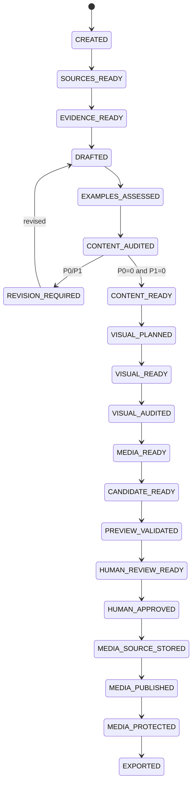

# Article Job State Machine

## States

| State | Meaning |
|---|---|
| `CREATED` | validated job spec exists |
| `SOURCES_READY` | source bundle is fixed and verified |
| `EVIDENCE_READY` | evidence / ambiguity ledger is available |
| `DRAFTED` | versioned draft and claim artifacts exist |
| `EXAMPLES_ASSESSED` | technical examples extracted and bounded verification completed |
| `CONTENT_AUDITED` | independent content audit exists |
| `REVISION_REQUIRED` | P0/P1 content finding remains |
| `CONTENT_READY` | content audit is clean |
| `VISUAL_PLANNED` | collection visual requirement and plan set are fixed |
| `VISUAL_READY` | required semantic visual/master candidates are materialized, or valid empty visual set exists |
| `VISUAL_AUDITED` | visual audit manifest is clean |
| `MEDIA_READY` | required deterministic delivery variants/social media artifacts are fixed and validated |
| `CANDIDATE_READY` | MDX + metadata + exact local media set are fixed |
| `PREVIEW_VALIDATED` | target candidate successfully built and checked |
| `HUMAN_REVIEW_READY` | human review bundle is fixed |
| `HUMAN_APPROVED` | human approval binds exact candidate hash |
| `MEDIA_SOURCE_STORED` | approved privacy-normalized canonical media source is verified in private source storage |
| `MEDIA_PUBLISHED` | approved delivery master/variant objects are verified on public R2 |
| `MEDIA_PROTECTED` | published media has a verified recovery-protection receipt |
| `EXPORTED` | approved content/registry/provenance exported to repository branch/patch |
| `BLOCKED` | human decision / evidence / permission / tool required |
| `FAILED` | stage failed without valid output |
| `CANCELLED` | user cancelled the job |

## Normal path

## Gate summary

### `CREATED -> SOURCES_READY`

- topic / reader / article mode valid
- public/private boundary declared
- network / external AI / image-generation permission declared
- source refs fixed

### `SOURCES_READY -> EVIDENCE_READY`

- evidence references known source records
- current/version-sensitive claims have adequate source
- ambiguity retained
- no source-less external fact promoted

### `EVIDENCE_READY -> DRAFTED`

- fixed evidence bundle
- exact Skill snapshot / response schema
- taxonomy / content / interactive registry snapshot
- draft / claim / metadata / visual-needs outputs validate
- citation markers reference only fixed Source IDs

AI responseをcanonical site contentへ直接writeしない。

### `DRAFTED -> EXAMPLES_ASSESSED`

all article modesでdeterministic example extractorを実行する。exampleが0件でもempty manifestでvalid。

exampleがある場合:

- exact draft span / content hashでrecord化
- illustrative / syntax_checked / sandbox_executed / evidence_observed / not_verifiableへ分類
- arbitrary AI codeをhostで直接実行しない
- sandboxはversioned isolated profileのみ
- system/external mutation commandを自動実行しない
- observed outputはactual execution / evidence lineage required
- failure / limitationをmanifestへ残す

`EXAMPLES_ASSESSED`は全example passの意味ではない。

### `EXAMPLES_ASSESSED -> CONTENT_AUDITED`

fresh auditorがtarget draft / fixed evidence / citation binding / technical example verification manifestからmaterial claimを再抽出する。

critical tutorial example failure、unsupported observed output、危険なcommand scope欠落等はP1になり得る。

### Revision loop

- validated findingに限定
- new material claimはevidence binding + re-audit
- changed code/command blockはexample verification stale
- finite revision budget
- P0/P1残存 + budget exhausted => `BLOCKED`

### `CONTENT_AUDITED -> CONTENT_READY`

- P0 = 0
- P1 = 0
- publication blocker = 0

### `CONTENT_READY -> VISUAL_PLANNED`

- collection visual policy fixed
- plan set binds exact clean draft hash
- factual visualとdecorative visualを区別
- Blogではhero plan required
- visual optional/none collectionではempty plan setを許可

### `VISUAL_PLANNED -> VISUAL_READY`

collection policyを満たすsemantic visual/master candidateをmaterializeする。

Blogはsource media / AI-generated conceptual hero / deterministic coverのいずれかのhero required。

visual不要collectionはempty visual setでvalid。

AI image permissionがなくてもrequired Blog heroはdeterministic coverへfallback可能。

### `VISUAL_READY -> VISUAL_AUDITED`

visual candidateがあればindependent audit。

- misleading fake UI / terminal / benchmarkなし
- relevance / crop / provenance valid

visual 0件ではempty pass manifestを許可する。ただしrequired visual不足はblocked。

rejectされるsemantic visualへvariant generation costを使わない。

### `VISUAL_AUDITED -> MEDIA_READY`

visual auditがcleanなmasterだけをdelivery artifact化する。

- raster media -> versioned prebuilt responsive variants
- no upscale
- profile/toolchain hash current
- deterministic social card/fixed derivative generated where required
- fixed/vector media -> valid `not_required` variant manifest
- media 0件 -> valid empty media-set manifest

Cloudflare Images APIはbaseline gateに使用しない。

profile / canonical master / generated derivativeが変われば`MEDIA_READY`以降はstale。

### `MEDIA_READY -> CANDIDATE_READY`

- frontmatter resolved
- citation markers compiled to public footnotes
- technical example manifest current
- collection-required media canonical source + delivery master + baseline variants current
- semantic Media Registry proposal valid
- planned immutable public keys derivable
- private canonical source identity derivable
- publication provenance proposal valid
- candidate manifest binds article / media / audits / evidence / examples / media profiles

external R2 mutationは要求しない。

### `CANDIDATE_READY -> PREVIEW_VALIDATED`

- ContentId / schema / taxonomy valid
- Astro check/build pass
- preview uses local candidate master/variant adapter
- canonical / OG / structured data / sitemap intent valid
- citation / footnote output valid
- responsive media HTML valid
- accessibility / hydration checks

### `PREVIEW_VALIDATED -> HUMAN_REVIEW_READY`

review bundleはexact candidate / preview / audits / evidence / example verification / media profile / planned private/public mediaをbindする。

### `HUMAN_REVIEW_READY -> HUMAN_APPROVED`

human laneのみapprovalを作成できる。

AI / Skill / fixtureはapproval capabilityを持たない。

### `HUMAN_APPROVED -> MEDIA_SOURCE_STORED`

raster/vector content mediaについて、approved candidateへbindしたprivacy-normalized canonical sourceを`private-canonical-media-storage-contract.md`に従ってprivate source-media storageへupload/reuseする。

required:

- candidate/approval unchanged
- canonical SHA/profile/toolchain identity一致
- private source object verified
- no public custom domain dependency
- CanonicalSourceStorageReceipt complete

raw HEIC/JPEG/PNGをそのままsource bucketへuploadしない。

media 0件 / bundled small site asset / explicitly non-persisted media classはdeterministic `not_required` result可。

failure時:

- public media publicationへ進めない
- candidate/approvalをmutateしない
- local canonical artifactを保持しidempotent retry

### `MEDIA_SOURCE_STORED -> MEDIA_PUBLISHED`

- candidate hash matches approval
- public media upload permission valid
- approved exact delivery master + required baseline variantsだけをcontent-addressed R2 keyへupload/reuse
- complete required object set post-upload verification
- immutable cache metadata present
- MediaPublicationManifest complete
- media 0件ならempty successful publication manifest可

partial failureではstateを`MEDIA_SOURCE_STORED`に保ちidempotent retryする。

### `MEDIA_PUBLISHED -> MEDIA_PROTECTED`

public delivery R2を唯一のrecovery copyにしない。

- MediaPublicationManifestがcandidate / approvalへbind
- published required master/variant object identityを再検証
- protection requestをinfra-owned operationへ渡す
- separate private protected-media bucketへexact copy/reuse
- required Bucket Lock policy verify
- MediaProtectionReceiptがcandidate / approval / publication manifestへbind
- receipt object set = publication required object set

media 0件ではdeterministic empty/none protection resultを許可する。

protection失敗時:

- Git export禁止
- stateは`MEDIA_PUBLISHED`に留める
- already-published immutable objectを変更せずidempotent retry

### `MEDIA_PROTECTED -> EXPORTED`

- candidate / approval / source storage / media publication / media protection chain一致
- repository base checked
- MDX / frontmatter / Media Registry / Publication Provenanceをdeterministic export
- canonical source SHA/storage-class receipt hashをcompact provenanceへ記録
- public mediaを持つrevisionはpublication/protection receipt hashを記録

PR creation、merge、deployは別external side effect。

## Staleness rules

- source change => evidence and downstream stale
- evidence change => draft and downstream stale
- material draft change => examples / audit and downstream stale
- unchanged example hash + same profile resultはreuse可能
- visual plan change => visual candidate / audit downstream stale
- semantic visual/canonical master change => visual audit + media/delivery downstream stale
- media ingest/delivery profile/toolchain change => MEDIA_READY and downstream stale
- generated delivery bytes change => candidate / preview / approval / source-publication/protection downstream stale
- candidate change after approval => approval stale; external media storage/publication/protection禁止
- CanonicalSourceStorageReceipt mismatch => public publication禁止
- MediaPublicationManifest change => protection receipt stale
- repository base / material build config change => preview revalidation required

## Recovery

same request fingerprint + verified immutable artifactはreuse可能。

private canonical source storage、public media publication、protected media copyはいずれもcontent-addressed identityによりidempotent retry可能。

retryのためにgateを弱めない。
