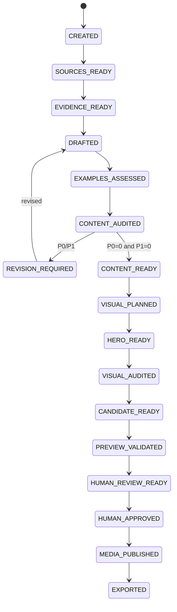

# Article Job State Machine

## States

| State | Meaning |
|---|---|
| `CREATED` | validated job spec exists |
| `SOURCES_READY` | source bundle is fixed and verified |
| `EVIDENCE_READY` | evidence / ambiguity ledger is available |
| `DRAFTED` | versioned draft and claim artifacts exist |
| `EXAMPLES_ASSESSED` | technical examples extracted and bounded verification completed |
| `CONTENT_AUDITED` | independent content audit exists |
| `REVISION_REQUIRED` | P0/P1 content finding remains |
| `CONTENT_READY` | content audit is clean |
| `VISUAL_PLANNED` | hero strategy / visual plan is fixed |
| `HERO_READY` | selected source/generated/deterministic hero exists |
| `VISUAL_AUDITED` | independent visual audit is clean |
| `CANDIDATE_READY` | MDX + metadata + local normalized media candidate is fixed |
| `PREVIEW_VALIDATED` | target candidate successfully built and checked |
| `HUMAN_REVIEW_READY` | human review bundle is fixed |
| `HUMAN_APPROVED` | human approval binds exact candidate hash |
| `MEDIA_PUBLISHED` | approved candidate media objects are verified on R2 |
| `EXPORTED` | approved candidate metadata/content exported to repository branch/patch |
| `BLOCKED` | human decision / evidence / permission / tool required |
| `FAILED` | stage failed without valid output |
| `CANCELLED` | user cancelled the job |

## Normal path

## Gate summary

### `CREATED -> SOURCES_READY`

- topic / reader / article mode valid
- public/private boundary declared
- network / external AI / image-generation permission declared
- source refs fixed

### `SOURCES_READY -> EVIDENCE_READY`

- evidence references known source records
- current/version-sensitive claims have adequate source
- ambiguity retained
- no source-less external fact promoted

### `EVIDENCE_READY -> DRAFTED`

- fixed evidence bundle
- exact Skill snapshot / response schema
- taxonomy / content / interactive registry snapshot
- draft / claim / metadata / visual-needs outputs validate
- citation markers, if any, reference only fixed Source IDs

AI responseをcanonical site contentへ直接writeしない。

### `DRAFTED -> EXAMPLES_ASSESSED`

all article modesでdeterministic example extractorを実行する。technical exampleが0件でもempty manifestを生成してgateを通過できる。

software-oriented exampleがある場合:

- exact draft span / content hashでrecord化
- illustrative / syntax_checked / sandbox_executed / evidence_observed / not_verifiableへ分類
- arbitrary AI codeをhostで直接実行しない
- sandbox executionはversioned isolated profileだけ
- external/system mutation commandを自動実行しない
- observed outputはactual execution / evidence lineageを要求
- verification failure / limitationをmanifestへ残す

`EXAMPLES_ASSESSED`は「全exampleがpass」の意味ではない。auditorがverification classとlimitationを判断できる状態を意味する。

exact contractは`contracts/technical-example-verification-contract.md`。

### `EXAMPLES_ASSESSED -> CONTENT_AUDITED`

fresh auditorが:

- target draft
- fixed evidence
- citation binding
- technical example verification manifest

からmaterial claimを再抽出し、P0/P1/P2を返す。

critical tutorial example failure、unsupported observed output、dangerous command scope欠落等はP1になり得る。

### Revision loop

- accepted finding / consistency changeに限定
- new material claimはevidence binding + re-audit
- changed code/command blockはexample verification stale -> 再assessment
- finite revision budget
- budget exhausted + P0/P1 => `BLOCKED`

### `CONTENT_AUDITED -> CONTENT_READY`

- P0 = 0
- P1 = 0
- publication blocker = 0

### `CONTENT_READY -> VISUAL_PLANNED`

- collection media requirement resolved
- visual plan binds exact clean draft hash
- factual visualとdecorative heroを区別

### `VISUAL_PLANNED -> HERO_READY`

Blogはsource hero / AI-generated conceptual hero / deterministic coverのいずれかを持つ。

external image generation permissionがなければdeterministic fallback。

### `HERO_READY -> VISUAL_AUDITED`

- selected image binds visual plan / draft hash
- fake UI / fake terminal / fake benchmark等のmisleading depictionなし
- crop / relevance / provenance valid

### `VISUAL_AUDITED -> CANDIDATE_READY`

- normalized local hero master valid
- deterministic social card candidate valid
- frontmatter resolved
- citation markers deterministically compiled to public footnotes
- semantic media registry proposal valid
- planned immutable R2 object keys derivable
- candidate manifest binds article / media / audits / evidence / example verification

public R2 uploadは要求しない。

### `CANDIDATE_READY -> PREVIEW_VALIDATED`

- Astro schema/check/build pass
- preview uses local candidate media adapter
- canonical / OG / structured data / sitemap intent valid
- logical citation / footnote output valid
- responsive media HTML valid
- accessibility / hydration checks

### `PREVIEW_VALIDATED -> HUMAN_REVIEW_READY`

review bundleはexact candidate / preview / audits / evidence / example verification summary / planned public mediaをbindする。

### `HUMAN_REVIEW_READY -> HUMAN_APPROVED`

human laneのみapprovalを作成できる。

AI / Skill / fixtureはapproval capabilityを持たない。

### `HUMAN_APPROVED -> MEDIA_PUBLISHED`

- candidate hash still matches approval
- public media upload authorization valid
- exact approved local normalized mediaだけをcontent-addressed R2 keyへupload/reuse
- post-upload verification complete
- MediaPublicationManifest complete

partial failureではstateを`HUMAN_APPROVED`に保ち、idempotent retryする。

### `MEDIA_PUBLISHED -> EXPORTED`

- candidate / approval / media publication manifest一致
- repository base checked
- MDX / frontmatter / Media Registry / Publication Provenanceをdeterministic export
- exportはapproved content/media identityを変更しない

PR creation、merge、deployは別external side effect。

## Staleness rules

- source change => evidence and downstream stale
- evidence change => draft and downstream stale
- material draft change => example assessment, content audit and downstream stale
- unchanged example content hash + same execution profile resultはreuse可能
- visual plan change => hero / visual audit downstream stale
- selected media bytes change => candidate / preview / approval / publication stale
- candidate change after approval => approval stale; public media publication禁止
- repository base / build config material change => preview revalidation required

## Recovery

same request fingerprint + verified immutable artifactはreuse可能。

media publicationはcontent-addressed keyによりidempotent retry可能。

retryのためにgateを弱めない。
