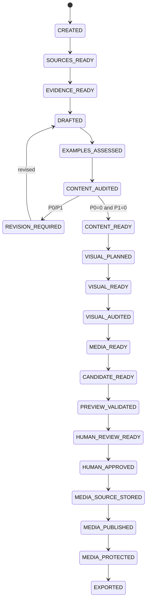

# Article Job State Machine

## States

| State | Meaning |
|---|---|
| `CREATED` | validated job spec exists |
| `SOURCES_READY` | source bundle is fixed, verified, and source disclosure records exist |
| `EVIDENCE_READY` | evidence / ambiguity ledger is available |
| `DRAFTED` | versioned draft/claim artifacts exist |
| `EXAMPLES_ASSESSED` | technical examples extracted and bounded verification complete |
| `CONTENT_AUDITED` | independent content audit exists |
| `REVISION_REQUIRED` | P0/P1 content finding remains |
| `CONTENT_READY` | content audit clean |
| `VISUAL_PLANNED` | visual requirement/plan set fixed |
| `VISUAL_READY` | required semantic visual/canonical master candidates materialized, or valid empty set |
| `VISUAL_AUDITED` | independent visual audit clean |
| `MEDIA_READY` | deterministic delivery variants/social artifacts fixed and validated |
| `CANDIDATE_READY` | exact approval content/media/support target fixed |
| `PREVIEW_VALIDATED` | exact candidate build/check pass |
| `HUMAN_REVIEW_READY` | human review bundle fixed |
| `HUMAN_APPROVED` | human approval binds exact candidate hash |
| `MEDIA_SOURCE_STORED` | required approved canonical source persistence verified, or valid not-required result |
| `MEDIA_PUBLISHED` | required approved public delivery persistence verified, or valid empty/not-required result |
| `MEDIA_PROTECTED` | required exact-byte protection verified, or valid empty/not-required result |
| `EXPORTED` | approved content + cleanup-safe durable provenance exported/verified in repository worktree/patch |
| `BLOCKED` | human/evidence/disclosure/permission/lifecycle/tool required |
| `FAILED` | stage failed without valid output |
| `CANCELLED` | operator cancelled job |

## Normal path

## Permission and disclosure model

`ArticleJobSpec.permissions` is an upper bound, not approval/capability/input-disclosure proof。

- `networkAccess` gates network source acquisition
- `externalTextAI` gates external semantic text/vision provider use
- `externalImageAI` gates image-generation provider use
- `localMediaProcessing` gates ingest/variant toolchain execution
- `privateCanonicalMediaStorage` gates required private canonical source persistence
- `publicMediaUpload` gates required public delivery persistence
- `protectedMediaOperation` gates required protected-copy persistence
- `repositoryExport` gates transition to `EXPORTED`

External provider-use permission does **not** admit any source/artifact bytes。Every external request must separately satisfy `contracts/external-ai-disclosure-contract.md` / ADR-0026。

- private/unknown disclosure defaults deny
- secret-bearing actual bytes hard-deny
- `publicSafe`/citation/trust class do not imply disclosure
- derived-only input may send only the admitted derived artifact
- exact request artifact set must equal `ExternalAiDisclosureManifest.entries`
- changed input bytes/hash stale prior admission

Permission=true never overrides disclosure admission, human approval, design/provider lifecycle, provider credentials, or explicit external action authorization。

For genuinely `not_required`/empty media stages, deterministic empty result may advance without a permission guarding a nonexistent operation。A required operation cannot become `not_required` merely because permission=false。

## Content/evidence lane

### `CREATED -> SOURCES_READY`

Required:

- job requirements/permission/disclosure policy binding validate
- candidate discovery complete enough
- network acquisition uses `networkAccess=true`
- executor acquires/pins exact source identity
- each SourceRecord gets current `externalAiDisclosureRef`
- AI-returned URL is not evidence until acquisition/pinning

A source can be disclosure-denied and still become a valid locally-used SourceRecord。`SOURCES_READY` does not mean every source is externally disclosable。

### External semantic request gate

Before **every external** source-discovery/evidence/author/audit/revision/visual-plan/visual-audit call:

1. resolve exact final serialized request artifacts;
2. require provider-use permission for the stage;
3. build current `ExternalAiDisclosureManifest`;
4. validate every exact/derived input disclosure record and hash;
5. reject deny/unknown/stale/hard-secret input;
6. require manifest artifact set = actual outbound provider input set;
7. bind manifest SHA to request/run lineage;
8. call provider only after all checks pass。

If a required input is disclosure-denied:

- use admitted local derivative;
- use configured local/non-external backend;
- request explicit authorization where appropriate;
- narrow/remove dependent claim;
- or transition `BLOCKED` with limitation。

Do not silently omit required evidence and claim a complete result。

### `SOURCES_READY -> EVIDENCE_READY`

- EvidenceRecord refs exact SourceRecord hashes
- time-sensitive material facts freshness checked
- ambiguity retained
- no source-less external fact promoted
- if evidence stage is external, exact disclosure manifest gate passed

Evidence may be produced locally from disclosure-denied sources; that does not automatically make EvidenceRecord/source externally disclosable later。

### `EVIDENCE_READY -> DRAFTED`

- fixed evidence bundle + registry snapshots + exact Skill/schema
- external author run requires `externalTextAI=true` + exact disclosure manifest
- draft/claim/metadata/visual-needs outputs validate
- citation markers only fixed Source IDs
- AI does not write canonical content tree

### `DRAFTED -> EXAMPLES_ASSESSED`

Every draft runs deterministic example extraction; zero examples => valid empty manifest。

Only allowlisted verifier profiles may execute。No arbitrary host/system/cloud mutation。

### `EXAMPLES_ASSESSED -> CONTENT_AUDITED`

Fresh auditor reads target draft + fixed evidence + citations + example verification, not author private reasoning。

If auditor is external, all target/evidence/context artifacts still require request-level disclosure admission; “fixed artifact” does not imply disclosure permission。

### Revision loop

- revision limited to validated findings/evidence
- new material claim => evidence binding + re-audit
- new/changed external inputs => fresh disclosure admission
- changed example => verification stale
- finite revision budget
- P0/P1 after budget => `BLOCKED`

### `CONTENT_AUDITED -> CONTENT_READY`

- P0=0
- P1=0
- publication blocker=0
- unresolved disclosure limitation affecting claimed completeness=0

## Visual/media candidate lane

### `CONTENT_READY -> VISUAL_PLANNED`

- clean draft hash bound
- factual/decorative visual distinction
- Blog hero required; optional collections may use empty set
- external visual planner gets only disclosure-admitted article/evidence context

### `VISUAL_PLANNED -> VISUAL_READY`

Materialize source/AI/deterministic semantic visual/canonical master candidate。

If external image generation is selected:

- `externalImageAI=true`
- prompt/context/reference-image artifacts pass exact disclosure manifest gate
- raw/private image is not sent merely because image generation is enabled

If media ingest is required, `localMediaProcessing=true`。

No persistent remote media mutation。

### `VISUAL_READY -> VISUAL_AUDITED`

Independent visual audit before variants。Required checks include relevance, fake factual UI/terminal/benchmark, crop/quality, provenance/rights concerns。

External visual audit receives only admitted target image/article context; local visual audit can process denied-private inputs without creating external disclosure authority。

### `VISUAL_AUDITED -> MEDIA_READY`

Only audited masters get deterministic delivery artifacts:

- versioned prebuilt variants
- no upscale
- deterministic social card/fixed derivative
- fixed/vector => `not_required`
- media0 => empty media-set

`localMediaProcessing=true` required when processing is actually needed。Cloudflare Images not required。

### `MEDIA_READY -> CANDIDATE_READY`

Candidate binds:

- MDX/frontmatter/route/ContentId
- source/evidence/claim ledgers
- approved/public-safe durable material-claim ledger proposal
- citations/examples/content+visual audits
- canonical source SHA/ingest profile
- delivery variants/profile
- rights/media registry proposal
- source/public/protection persistence plans
- repository base/build fingerprint

Disclosure policy/manifest lineage used during semantic generation is fixed in job artifacts but private disclosure manifests are not reader content and need not alter candidate article bytes。

No provider mutation required。

### `CANDIDATE_READY -> PREVIEW_VALIDATED`

Local candidate adapter only。Validate static output/SEO/citation/responsive media/a11y/hydration/performance appropriate to current phase。

### `PREVIEW_VALIDATED -> HUMAN_REVIEW_READY`

Review bundle fixes exact candidate, material claims/support, audits, limitations, media plan, update diff where applicable。

Human review exposes material limitations caused by unavailable/denied evidence where they affect article completeness; it does not expose private source bodies unnecessarily。

### `HUMAN_REVIEW_READY -> HUMAN_APPROVED`

Human lane only。AI/Skill cannot create approval capability。

## Persistence lane

### `HUMAN_APPROVED -> MEDIA_SOURCE_STORED`

If canonical source persistence is required:

- `privateCanonicalMediaStorage=true`
- lifecycle/provider sub-gates allow operation
- candidate/approval unchanged
- canonical SHA/profile/toolchain match
- provider source target private per accepted infra design
- CanonicalSourceStorageReceipt valid
- raw original not stored as canonical source

If no source persistence is semantically required, validated `not_required` result can advance without source write。

Failure/permission/lifecycle absence => remain `HUMAN_APPROVED`/`BLOCKED`; never public-publish around it。

### `MEDIA_SOURCE_STORED -> MEDIA_PUBLISHED`

If public media exists:

- `publicMediaUpload=true`
- lifecycle/provider gates permit operation
- exact approved delivery set only
- content-addressed immutable objects
- complete required variants/cache metadata
- MediaPublicationManifest valid

Media0 can use deterministic empty manifest。

Failure => remain `MEDIA_SOURCE_STORED`/`BLOCKED`。

### `MEDIA_PUBLISHED -> MEDIA_PROTECTED`

If public required objects exist:

- `protectedMediaOperation=true`
- lifecycle/provider gates permit protection
- public manifest bound to same candidate/approval
- exact public identity reverified
- full MediaProtectionReceipt valid
- receipt/publication object sets exact-equal

Media0 may use deterministic empty protection result。

Failure => remain `MEDIA_PUBLISHED`/`BLOCKED`; no export。

### `MEDIA_PROTECTED -> EXPORTED`

Requires `repositoryExport=true`。

Executor additionally:

1. revalidates candidate/approval/source/public/protection chain;
2. revalidates repository base;
3. derives `CompactSourceRef[]`;
4. derives `CompactMaterialClaimBinding[]` from approved detailed artifacts;
5. proves durable claim support semantics equal approved proposal;
6. derives compact canonical source identities;
7. derives `CompactMediaRecoveryBinding` from full valid receipt when public media exists;
8. exact-equality checks mediaRecovery/publication/protection object sets;
9. derives safe external-AI disclosure/run lineage hashes for external runs without exporting private disclosure/source bodies;
10. rejects private body/path/credential/signed URL in durable provenance;
11. exports MDX/frontmatter/Media Registry/Publication Provenance + separately approved registry changes;
12. rehashes exported bytes。

`EXPORTED` means required long-term claim traceability, media restore entrypoint, and safe AI/disclosure lineage no longer depend on deleted detailed job artifacts。

Post-approval operational receipt/binding fields may be appended only while approved content/media/support remains unchanged。Any material candidate change => approval stale and persistence/export blocked until new review。

PR/merge/push/deploy are separate operations, not implied by `EXPORTED` or `repositoryExport=true`。

## Staleness rules

- ArticleJobSpec material/permission/disclosure-policy/explicit-authorization change => affected downstream stale
- source bytes or disclosure record change => affected external request manifests stale
- source change => evidence downstream stale
- evidence/support change => draft/claim/audit downstream stale
- material draft change => examples/audit/durable claim proposal stale
- visual plan/master change => visual audit/media stale
- ingest/delivery profile/toolchain change => `MEDIA_READY` downstream stale
- candidate content/media/support change after approval => approval stale
- source receipt mismatch => public publish blocked
- publication manifest mismatch/change => protection stale
- protection receipt mismatch/change => mediaRecovery/export stale
- durable claim/mediaRecovery mismatch => EXPORTED invalid / cleanup blocked

## Recovery / retry

Same exact immutable artifact/request may be reused only when hashes/profile/policy **and disclosure manifest where external** prove identity。

Transport retry for an external provider uses the same request/disclosure manifest; changed inputs require a new admitted request。

Source/public/protection operations are idempotent for same content-addressed bytes where backend contract supports it。

Retry never weakens permissions/disclosure/lifecycle/approval/evidence/recovery gates。

## Cleanup

Cleanup is a separate explicit operation, not a state transition。See `operations/article-job-retention-policy.md` / ADR-0024。

It requires a durable Git ref with valid material claim lineage, compact mediaRecovery, safe required external-AI run/disclosure hash lineage, persistence-chain validation, no unresolved orphan tracking need, and explicit operator confirmation。

Detailed private disclosure records/manifests may be deleted after cleanup eligibility if their required safe lineage is already durable and no unresolved incident/orphan need remains。
