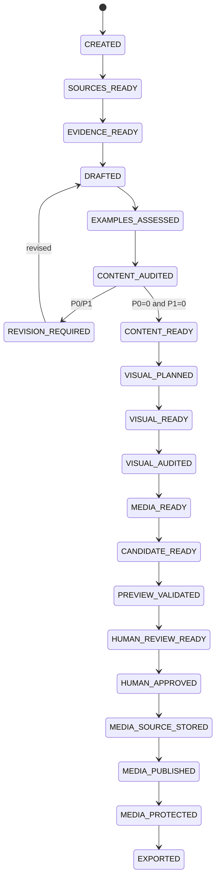

# Article Job State Machine

## States

| State | Meaning |
|---|---|
| `CREATED` | validated job spec exists |
| `SOURCES_READY` | source bundle fixed and verified |
| `EVIDENCE_READY` | evidence / ambiguity ledger available |
| `DRAFTED` | versioned draft/claim artifacts exist |
| `EXAMPLES_ASSESSED` | technical examples extracted and bounded verification complete |
| `CONTENT_AUDITED` | independent content audit exists |
| `REVISION_REQUIRED` | P0/P1 content finding remains |
| `CONTENT_READY` | content audit clean |
| `VISUAL_PLANNED` | visual requirement/plan set fixed |
| `VISUAL_READY` | required semantic visual/canonical master candidates materialized, or valid empty set |
| `VISUAL_AUDITED` | independent visual audit clean |
| `MEDIA_READY` | deterministic delivery variants/social artifacts fixed and validated |
| `CANDIDATE_READY` | exact approval content/media/support target fixed |
| `PREVIEW_VALIDATED` | exact candidate build/check pass |
| `HUMAN_REVIEW_READY` | human review bundle fixed |
| `HUMAN_APPROVED` | human approval binds exact candidate hash |
| `MEDIA_SOURCE_STORED` | approved privacy-normalized canonical source persist/verify complete |
| `MEDIA_PUBLISHED` | approved delivery object set public persist/verify complete |
| `MEDIA_PROTECTED` | exact published object set has valid full protection receipt |
| `EXPORTED` | approved content + cleanup-safe durable provenance exported/verified in repository worktree/patch |
| `BLOCKED` | human/evidence/permission/tool required |
| `FAILED` | stage failed without valid output |
| `CANCELLED` | operator cancelled job |

## Normal path

## Content/evidence lane

### `CREATED -> SOURCES_READY`

- job requirements/permission scope valid
- source candidate discovery complete enough
- executor acquired/pinned exact source identity
- no AI-returned URL treated as evidence without acquisition

### `SOURCES_READY -> EVIDENCE_READY`

- EvidenceRecord refs exact SourceRecord hashes
- time-sensitive material facts freshness checked
- ambiguity retained
- no source-less external fact promoted

### `EVIDENCE_READY -> DRAFTED`

- fixed evidence bundle + registry snapshots + exact Skill/schema
- draft/claim/metadata/visual-needs outputs validate
- citation markers only fixed Source IDs
- AI does not write canonical content tree

### `DRAFTED -> EXAMPLES_ASSESSED`

Every draft runs deterministic example extraction; zero examples => valid empty manifest。

Examples are classified and only allowlisted profiles may execute。No arbitrary host/system/cloud mutation。

### `EXAMPLES_ASSESSED -> CONTENT_AUDITED`

Fresh auditor reads target draft + fixed evidence + citation bindings + example verification, not author private reasoning。

### Revision loop

- revision limited to validated finding/evidence
- new material claim => evidence binding + re-audit
- changed example => verification stale
- finite revision budget
- P0/P1 remains after budget => BLOCKED

### `CONTENT_AUDITED -> CONTENT_READY`

- P0=0
- P1=0
- publication blocker=0

## Visual/media candidate lane

### `CONTENT_READY -> VISUAL_PLANNED`

- exact clean draft hash bound
- factual/decorative visual distinction
- Blog hero required; optional collections may use empty plan set

### `VISUAL_PLANNED -> VISUAL_READY`

Materialize semantic visual/canonical master candidate:

- source media
- AI conceptual hero
- deterministic cover/diagram

No persistent remote media mutation。

### `VISUAL_READY -> VISUAL_AUDITED`

Independent visual audit before variants。

Required checks include relevance, fake factual UI/terminal/benchmark, crop/quality, provenance/rights concerns。

### `VISUAL_AUDITED -> MEDIA_READY`

Only audited masters get deterministic delivery artifacts:

- versioned prebuilt variants
- no upscale
- deterministic social card/fixed derivative
- fixed/vector => `not_required` manifest
- media 0 => empty media-set manifest

Cloudflare Images not required。

Profile/master/derived bytes change => MEDIA_READY and downstream stale。

### `MEDIA_READY -> CANDIDATE_READY`

Candidate binds:

- MDX/frontmatter/route/ContentId
- source/evidence/claim ledgers
- approved/public-safe **durable material-claim ledger proposal**
- citations/examples/content+visual audits
- canonical source SHA/ingest profile
- delivery variants/profile
- rights/media registry proposal
- source/public persistence plans
- repository base/build fingerprint

No source/public/protected provider mutation required。

### `CANDIDATE_READY -> PREVIEW_VALIDATED`

Local candidate adapter used for media. Validate Astro/static output/SEO/citation/responsive media/a11y/hydration/performance checks applicable to current phase。

### `PREVIEW_VALIDATED -> HUMAN_REVIEW_READY`

Review bundle fixes exact candidate, material claim/support summary, audits, limitations, media profile/publication plan, update diff where applicable。

### `HUMAN_REVIEW_READY -> HUMAN_APPROVED`

Human lane only。AI/Skill cannot create approval capability。

## Persistence lane

### `HUMAN_APPROVED -> MEDIA_SOURCE_STORED`

Persist/reuse exact approved privacy-normalized canonical source for source-persistent media:

- candidate/approval unchanged
- SHA/profile/toolchain match
- provider target private per accepted infra design when activated
- CanonicalSourceStorageReceipt
- raw HEIC/JPEG/AI original not stored as canonical source

Failure => remain HUMAN_APPROVED, no public publish。

### `MEDIA_SOURCE_STORED -> MEDIA_PUBLISHED`

- exact approved delivery set only
- content-addressed immutable public objects
- required variants complete
- cache metadata as defined
- MediaPublicationManifest

Failure => remain MEDIA_SOURCE_STORED。

### `MEDIA_PUBLISHED -> MEDIA_PROTECTED`

- public manifest bound to same candidate/approval
- exact public object identity reverified
- infra protection operation
- full MediaProtectionReceipt
- exact receipt/publication object-set equality

Failure => remain MEDIA_PUBLISHED; no Git export。

### `MEDIA_PROTECTED -> EXPORTED`

`MEDIA_PROTECTED` full receipt validity alone is not enough for cleanup-safe export。

Executor must additionally:

1. revalidate candidate/approval/source-storage/publication/protection chain
2. revalidate repository base
3. derive final durable `CompactSourceRef[]`
4. derive `CompactMaterialClaimBinding[]` from approved claim/evidence/source artifacts
5. verify durable claim ledger semantics equal approved candidate proposal
6. derive canonical source compact identity/profile
7. derive `CompactMediaRecoveryBinding` from full valid MediaProtectionReceipt when public media exists
8. verify mediaRecovery object set exactly equals current MediaPublicationManifest + full receipt
9. reject any private body/path/credential/signed URL in durable provenance
10. export MDX/frontmatter/Media Registry/Publication Provenance + separately approved registry changes
11. rehash exported bytes

`EXPORTED` therefore means required long-term traceability/recovery no longer depends on detailed private job artifacts。

Post-approval receipt/binding fields may be appended deterministically only while approved content/media/support remains unchanged。If content/media/support must change, approval stale and persistence operations stop until new candidate/review。

PR creation/merge/deploy remain separate side effects。

## Staleness rules

- source change => evidence downstream stale
- evidence/support change => draft/claim/audit downstream stale
- material draft change => examples/audit/durable claim proposal downstream stale
- visual plan/master change => visual audit/media downstream stale
- ingest/delivery profile/toolchain change => media/candidate downstream stale
- candidate content/media/support change after approval => approval stale; no persistence continue
- CanonicalSourceStorageReceipt mismatch => no public publish
- MediaPublicationManifest mismatch/change => protection stale
- MediaProtectionReceipt mismatch/change => mediaRecovery/export stale
- durable claim/mediaRecovery mismatch => EXPORTED invalid / cleanup blocked
- repository base/material build change => preview/export revalidation according to change scope

## Recovery / retry

Same exact immutable artifact/request may be reused when hashes/profile/policy prove identity。

Source storage, public publication, protection are idempotent for same content-addressed bytes。

Retry never weakens permission/approval/evidence/recovery gates。

## Cleanup relationship

Cleanup is not a state transition after EXPORTED in this state machine; it is an explicit operational action defined by `operations/article-job-retention-policy.md` / ADR-0024。

Cleanup requires durable Git ref verification, durable material claim support, compact mediaRecovery, full persistence-chain validation, and explicit operator confirmation。
