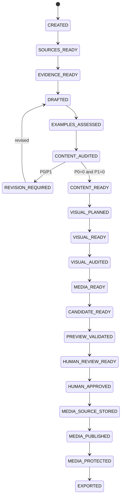

# Article Job State Machine

## States

| State | Meaning |
|---|---|
| `CREATED` | validated job spec exists |
| `SOURCES_READY` | source bundle fixed and verified |
| `EVIDENCE_READY` | evidence / ambiguity ledger available |
| `DRAFTED` | versioned draft/claim artifacts exist |
| `EXAMPLES_ASSESSED` | technical examples extracted and bounded verification complete |
| `CONTENT_AUDITED` | independent content audit exists |
| `REVISION_REQUIRED` | P0/P1 content finding remains |
| `CONTENT_READY` | content audit clean |
| `VISUAL_PLANNED` | visual requirement/plan set fixed |
| `VISUAL_READY` | required semantic visual/canonical master candidates materialized, or valid empty set |
| `VISUAL_AUDITED` | independent visual audit clean |
| `MEDIA_READY` | deterministic delivery variants/social artifacts fixed and validated |
| `CANDIDATE_READY` | exact approval content/media/support target fixed |
| `PREVIEW_VALIDATED` | exact candidate build/check pass |
| `HUMAN_REVIEW_READY` | human review bundle fixed |
| `HUMAN_APPROVED` | human approval binds exact candidate hash |
| `MEDIA_SOURCE_STORED` | required approved canonical source persistence is verified, or valid not-required result exists |
| `MEDIA_PUBLISHED` | required approved public delivery persistence is verified, or valid empty/not-required result exists |
| `MEDIA_PROTECTED` | required exact-byte protection is verified, or valid empty/not-required result exists |
| `EXPORTED` | approved content + cleanup-safe durable provenance exported/verified in repository worktree/patch |
| `BLOCKED` | human/evidence/permission/lifecycle/tool required |
| `FAILED` | stage failed without valid output |
| `CANCELLED` | operator cancelled job |

## Normal path

## Permission model

`ArticleJobSpec.permissions` is an upper bound, not approval/capability proof。

- `networkAccess` gates network source acquisition
- `externalTextAI` gates external semantic text/vision provider calls
- `externalImageAI` gates image generation provider calls
- `localMediaProcessing` gates ingest/variant toolchain execution
- `privateCanonicalMediaStorage` gates required private canonical source persistence
- `publicMediaUpload` gates required public delivery persistence
- `protectedMediaOperation` gates required protected-copy persistence
- `repositoryExport` gates transition to EXPORTED

Permission=true never overrides human approval, `architecture/design-status.md`, `architecture/infrastructure-handoff.md`, provider credentials, or explicit external action authorization。

For a genuinely `not_required`/empty media stage, deterministic empty result may advance without an external permission that would otherwise guard a nonexistent operation。A required operation cannot be converted to `not_required` merely because permission=false。

## Content/evidence lane

### `CREATED -> SOURCES_READY`

- job requirements and permission scope validate
- candidate discovery complete enough
- if network acquisition is required, `networkAccess=true`
- executor acquired/pinned exact source identity
- AI-returned URL is not evidence until acquisition/pinning

### `SOURCES_READY -> EVIDENCE_READY`

- EvidenceRecord refs exact SourceRecord hashes
- time-sensitive material facts freshness checked
- ambiguity retained
- no source-less external fact promoted

### `EVIDENCE_READY -> DRAFTED`

- fixed evidence bundle + registry snapshots + exact Skill/schema
- if external semantic AI is used, `externalTextAI=true`
- draft/claim/metadata/visual-needs outputs validate
- citation markers only fixed Source IDs
- AI does not write canonical content tree

### `DRAFTED -> EXAMPLES_ASSESSED`

Every draft runs deterministic example extraction; zero examples => valid empty manifest。

Only allowlisted verifier profiles may execute. No arbitrary host/system/cloud mutation。

### `EXAMPLES_ASSESSED -> CONTENT_AUDITED`

Fresh auditor reads target draft + fixed evidence + citations + example verification, not author private reasoning。

### Revision loop

- revision limited to validated findings/evidence
- new material claim => evidence binding + re-audit
- changed example => verification stale
- finite revision budget
- P0/P1 after budget => BLOCKED

### `CONTENT_AUDITED -> CONTENT_READY`

- P0=0
- P1=0
- publication blocker=0

## Visual/media candidate lane

### `CONTENT_READY -> VISUAL_PLANNED`

- clean draft hash bound
- factual/decorative visual distinction
- Blog hero required; optional collections may use empty set

### `VISUAL_PLANNED -> VISUAL_READY`

Materialize source/AI/deterministic semantic visual/canonical master candidate。

If external image generation is selected, `externalImageAI=true`。If media ingest is required, `localMediaProcessing=true`。

No persistent remote media mutation。

### `VISUAL_READY -> VISUAL_AUDITED`

Independent visual audit before variants。Required checks include relevance, fake factual UI/terminal/benchmark, crop/quality, provenance/rights concerns。

### `VISUAL_AUDITED -> MEDIA_READY`

Only audited masters get deterministic delivery artifacts:

- versioned prebuilt variants
- no upscale
- deterministic social card/fixed derivative
- fixed/vector => `not_required`
- media0 => empty media-set

`localMediaProcessing=true` is required when processing is actually needed。

Cloudflare Images not required。

### `MEDIA_READY -> CANDIDATE_READY`

Candidate binds:

- MDX/frontmatter/route/ContentId
- source/evidence/claim ledgers
- approved/public-safe durable material-claim ledger proposal
- citations/examples/content+visual audits
- canonical source SHA/ingest profile
- delivery variants/profile
- rights/media registry proposal
- source/public/protection persistence plans
- repository base/build fingerprint

No provider mutation required。

### `CANDIDATE_READY -> PREVIEW_VALIDATED`

Local candidate adapter only. Validate static output/SEO/citation/responsive media/a11y/hydration/performance appropriate to current phase。

### `PREVIEW_VALIDATED -> HUMAN_REVIEW_READY`

Review bundle fixes exact candidate, material claims/support, audits, limitations, media plan, update diff where applicable。

### `HUMAN_REVIEW_READY -> HUMAN_APPROVED`

Human lane only。AI/Skill cannot create approval capability。

## Persistence lane

### `HUMAN_APPROVED -> MEDIA_SOURCE_STORED`

If canonical source persistence is required:

- `privateCanonicalMediaStorage=true`
- lifecycle/provider sub-gates allow operation
- candidate/approval unchanged
- canonical SHA/profile/toolchain match
- provider source target private per accepted infra design
- CanonicalSourceStorageReceipt valid
- raw original not stored as canonical source

If no source persistence is semantically required, validated `not_required` result can advance without source write。

Failure/permission/lifecycle absence => remain HUMAN_APPROVED/BLOCKED; never public-publish around it。

### `MEDIA_SOURCE_STORED -> MEDIA_PUBLISHED`

If public media exists:

- `publicMediaUpload=true`
- lifecycle/provider gates permit operation
- exact approved delivery set only
- content-addressed immutable objects
- complete required variants/cache metadata
- MediaPublicationManifest valid

Media0 can use deterministic empty manifest。

Failure => remain MEDIA_SOURCE_STORED/BLOCKED。

### `MEDIA_PUBLISHED -> MEDIA_PROTECTED`

If public required objects exist:

- `protectedMediaOperation=true`
- lifecycle/provider gates permit protection
- public manifest bound to same candidate/approval
- exact public identity reverified
- full MediaProtectionReceipt valid
- receipt/publication object sets exact-equal

Media0 may use deterministic empty protection result。

Failure => remain MEDIA_PUBLISHED/BLOCKED; no export。

### `MEDIA_PROTECTED -> EXPORTED`

Requires `repositoryExport=true`。

Executor additionally:

1. revalidates candidate/approval/source/public/protection chain
2. revalidates repository base
3. derives CompactSourceRefs
4. derives CompactMaterialClaimBindings from approved detailed artifacts
5. proves durable claim support semantics equal approved proposal
6. derives compact canonical source identities
7. derives CompactMediaRecoveryBinding from full valid receipt when public media exists
8. exact-equality checks mediaRecovery/publication/protection object sets
9. rejects private body/path/credential/signed URL in durable provenance
10. exports MDX/frontmatter/Media Registry/Publication Provenance + separately approved registry changes
11. rehashes exported bytes

EXPORTED means required long-term claim traceability and media restore entrypoint no longer depend on deleted detailed job artifacts。

Post-approval operational receipt/binding fields may be appended only while approved content/media/support remains unchanged。Any material candidate change => approval stale and persistence/export blocked until new review。

PR/merge/push/deploy are separate operations, not implied by EXPORTED or `repositoryExport=true`。

## Staleness rules

- ArticleJobSpec material/permission change => affected downstream stale
- source change => evidence downstream stale
- evidence/support change => draft/claim/audit downstream stale
- material draft change => examples/audit/durable claim proposal stale
- visual plan/master change => visual audit/media stale
- ingest/delivery profile/toolchain change => MEDIA_READY downstream stale
- candidate content/media/support change after approval => approval stale
- source receipt mismatch => public publish blocked
- publication manifest mismatch/change => protection stale
- protection receipt mismatch/change => mediaRecovery/export stale
- durable claim/mediaRecovery mismatch => EXPORTED invalid / cleanup blocked

## Recovery / retry

Same exact immutable artifact/request may be reused only when hashes/profile/policy prove identity。

Source/public/protection operations are idempotent for same content-addressed bytes where backend contract supports it。

Retry never weakens permissions/lifecycle/approval/evidence/recovery gates。

## Cleanup

Cleanup is a separate explicit operation, not a state transition。See `operations/article-job-retention-policy.md` / ADR-0024。

It requires a durable Git ref with valid material claim lineage, compact mediaRecovery, persistence-chain validation, no unresolved orphan tracking need, and explicit operator confirmation。
