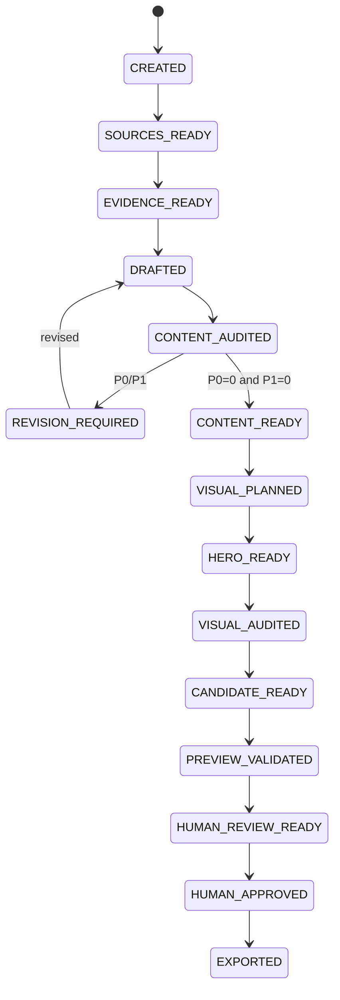

# Article Job State Machine

## States

| State | Meaning |
|---|---|
| `CREATED` | validated job spec exists |
| `SOURCES_READY` | source bundle is fixed and verified |
| `EVIDENCE_READY` | evidence / ambiguity ledger is available |
| `DRAFTED` | versioned draft and claim artifacts exist |
| `CONTENT_AUDITED` | independent content audit exists |
| `REVISION_REQUIRED` | P0/P1 content finding remains |
| `CONTENT_READY` | content audit is clean |
| `VISUAL_PLANNED` | hero strategy / visual plan is fixed |
| `HERO_READY` | selected source/generated/deterministic hero exists |
| `VISUAL_AUDITED` | independent visual audit is clean |
| `CANDIDATE_READY` | MDX + metadata + assets candidate is fixed |
| `PREVIEW_VALIDATED` | target candidate successfully built and checked |
| `HUMAN_REVIEW_READY` | human review bundle is fixed |
| `HUMAN_APPROVED` | human approval binds exact candidate hash |
| `EXPORTED` | approved candidate exported to repository branch/patch |
| `BLOCKED` | human decision / evidence / permission / tool required |
| `FAILED` | stage failed without valid output |
| `CANCELLED` | user cancelled the job |

## Normal path

## Gates

### `CREATED -> SOURCES_READY`

- topic / reader / article mode valid
- public/private boundary declared
- network / external AI / image-generation permission declared
- source discovery response validated where used
- source refs resolved to fixed identities
- private source material not unintentionally published

source が不足する場合、架空 source で埋めず `BLOCKED` または bounded requirement にする。

### `SOURCES_READY -> EVIDENCE_READY`

- evidence records reference known source records
- material software version/date claim has current-enough source
- unknown / ambiguity is retained
- no source-less external fact promoted to confirmed fact

zero evidence article は通常 Blog authoring へ進めない。opinion / diary 等、evidence requirement が異なる article mode は separate policy で明示する。

### `EVIDENCE_READY -> DRAFTED`

- fixed evidence bundle
- editorial Skill snapshot
- response schema
- taxonomy / content module snapshot
- provider response binds exact request fingerprint
- draft / claim / metadata / visual-needs outputs validate

AI response をそのまま `src/content/` へ copy しない。

### `DRAFTED -> CONTENT_AUDITED`

- fresh auditor context
- target draft + fixed evidence
- material claims re-extracted
- P0/P1/P2 findings have target span and evidence / reason

### Revision loop

- revision modifies only accepted findings / required consistency changes
- new material claim requires evidence binding and re-audit
- semantic revision has finite budget
- budget exhausted with P0/P1 => `BLOCKED`

### `CONTENT_AUDITED -> CONTENT_READY`

- P0 = 0
- P1 = 0
- unresolved publication blocker = 0
- title / description / taxonomy candidate internally consistent

P2 may remain if not publication-blocking, but human review bundle must show material unresolved P2 if relevant.

### `CONTENT_READY -> VISUAL_PLANNED`

- hero required policy resolved by collection
- visual plan binds exact clean draft hash
- factual/source image needs distinguished from decorative hero need

material text revision after this point makes visual plan stale.

### `VISUAL_PLANNED -> HERO_READY`

Blog:

- valid real/source hero, or
- validated AI-generated hero, or
- deterministic fallback cover

must exist.

AI generation permission missing => deterministic fallback, not silent external request.

### `HERO_READY -> VISUAL_AUDITED`

- selected image binds visual plan and draft hash
- no misleading fake UI / output / benchmark / evidence-like depiction
- no unintended text/logo issue
- crop / composition / article relevance acceptable
- provenance record complete

failed generated candidate can trigger bounded regeneration without changing semantic article revision count.

### `VISUAL_AUDITED -> CANDIDATE_READY`

- normalized hero web master valid
- social image derived or supplied
- frontmatter resolved
- local assets all available
- candidate manifest binds article / hero / audit / source bundle

### `CANDIDATE_READY -> PREVIEW_VALIDATED`

- Astro schema/check/build pass
- canonical/OG/JSON-LD/sitemap intent valid
- responsive hero output valid
- accessibility checks
- no unintended client hydration
- representative render exists

### `PREVIEW_VALIDATED -> HUMAN_REVIEW_READY`

human review bundle binds:

- exact candidate
- exact preview base commit / build fingerprint
- content/visual audit summaries
- source/evidence summary
- hero origin / provenance summary

### `HUMAN_REVIEW_READY -> HUMAN_APPROVED`

only human lane can create approval.

approval records:

- candidate SHA-256
- reviewer identity / asserted user identity
- approval basis / timestamp
- optional requested exceptions

AI / Skill / test fixture cannot produce valid approval.

### `HUMAN_APPROVED -> EXPORTED`

- candidate hash still matches approval
- no upstream artifact tamper
- export does not mutate approved MDX / selected hero content
- repository target branch / base checked

PR creation, merge, deploy are separate external side effects.

## Staleness rules

- source bundle change => evidence and all downstream stale
- evidence change => draft and all downstream stale
- draft material change => content audit and all downstream stale
- audit finding/resolution change => content-ready and visual downstream stale as applicable
- visual plan change => generated hero / visual audit downstream stale
- selected hero change => visual audit / candidate / preview / approval stale
- repository base / build config material change => preview validation stale; content approval remains candidate-specific but export must revalidate

## Recovery

retry must not weaken a gate.

same request fingerprint + verified existing output may reuse content-addressed artifact. changed semantic input creates a new version / downstream recomputation rather than overwriting historical artifact.
