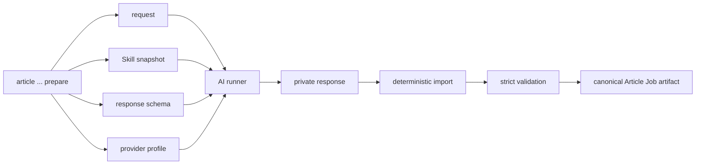

# Article AI Exchange

## Boundary

AI は fixed request を読み、fixed Skill / profile と response schema に従う provider-neutral response を返す。

canonical workspace write、artifact publication、state transition、human approval は deterministic executor だけが行う。

## Exchange envelope

| Input | Responsibility |
|---|---|
| `request_path` | exact job / sources / evidence / constraints / target hash |
| `skill_path` | exact repository-local Skill snapshot |
| `response_schema_path` | strict stage output contract |
| `provider_profile` | provider/model/runtime selection without credentials |

output:

- provider-neutral response in private staging
- run identity / token or cost metadata where available
- redacted error / warning

## Prepare -> run -> import



## Source discovery

semantic output is a source-candidate list, not canonical evidence.

executor resolves / pins selected source and records retrieval identity before evidence analysis.

## Evidence analysis

request contains fixed source catalog. response contains atomic evidence / ambiguity candidates with source refs.

import rejects unknown / stale source ref and source-less external fact.

## Authoring

request contains fixed evidence, editorial Skill snapshot, taxonomy/content-module snapshot.

response includes:

- draft MDX
- claim records
- metadata proposal
- taxonomy proposal
- visual needs

character counts / route / frontmatter correctness are checked by deterministic code, not AI self-report.

## Content audit

fresh context receives target draft + evidence + requirements, not author private reasoning.

response findings are validated against target draft span / evidence / severity.

## Revision

response may resolve known findings. unrelated rewrite / unsupported new fact is rejected or forces fresh evidence + re-audit.

## Visual planning

response is semantic `visual-plan`, not image bytes and not unrestricted final prompt.

executor compiles:

```text
visual plan
+ style profile
+ site hard restrictions
+ target aspect / safe area
= image generation request
```

## Image generation

`ImageGenerationBackend` receives immutable request.

output bytes are staged, probed, hashed, provenance-recorded, and only then published as generated visual artifact.

provider refusal / timeout / invalid bytes do not produce partial canonical hero.

## Visual audit

vision runner gets clean draft + visual plan + selected candidate. It must not rely solely on generator self-description.

## Human review

no semantic response can generate `HUMAN_APPROVED` state.

approval must target exact candidate hash through explicit human operation.

## Suggested CLI shape

names are proposed, not implementation SoT:

```text
site article init ...
site article guide JOB
site article sources prepare JOB
site article sources import JOB --response ...
site article evidence prepare JOB
site article author prepare JOB
site article audit prepare JOB
site article visual plan JOB
site article visual generate JOB
site article visual audit JOB
site article candidate JOB
site article preview JOB
site article approve JOB --candidate-sha ... --confirm
site article export JOB
```

A high-level `site article run JOB` may orchestrate safe automatic stages until a human gate / block.

## Retry budgets

semantic author/revision retry、image candidate regeneration、provider transient retry は異なる budget とする。

image regeneration must not consume content semantic revision count.

budget exhaustion weakens no validation rule; job becomes `BLOCKED` or uses defined deterministic visual fallback.

## Credentials

API key / token is not stored in job spec, provider profile, response manifest, prompt artifact, Git history.

credential delivery is environment / secret store responsibility.

## Current adapter candidate

architecture is provider-neutral。

2026-08-26 時点では OpenAI API の current image-generation candidate として GPT-Image-2 が利用でき、snapshot pin も提供される。exact model / snapshot は implementation-time provider profile で固定し、canonical architecture text の恒久値にはしない。
